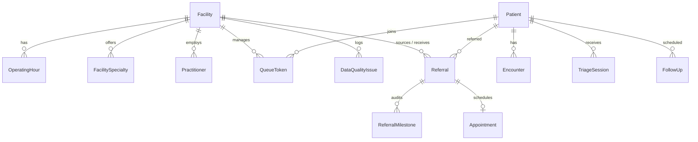

# MahaSwasthya Grid — Data Model & Schema Architecture

## 1. Relational Architecture Overview

MahaSwasthya Grid utilizes **PostgreSQL 17** with the **PostGIS 3.5** spatial extension, mapped through **Prisma ORM** with custom raw migrations for GiST indexing.



---

## 2. PostGIS Spatial Column & Indexing

The `Facility` entity contains standard float coordinates (`latitude`, `longitude`) alongside a native PostGIS geography column:

```sql
-- Migration 20260910181956_init
CREATE EXTENSION IF NOT EXISTS postgis;

ALTER TABLE "Facility" 
ADD COLUMN IF NOT EXISTS "location" geography(Point, 4326);

CREATE INDEX IF NOT EXISTS "idx_facilities_location" 
ON "Facility" USING GIST (location);
```

### Spatial Queries
Geodesic distance calculation and bounding radius lookups are executed using PostGIS spatial algorithms:
```sql
SELECT id, name, "facilityType",
       ST_Distance(location, ST_SetSRID(ST_MakePoint($1, $2), 4326)::geography) / 1000 AS "distanceKm"
FROM "Facility"
WHERE ST_DWithin(location, ST_SetSRID(ST_MakePoint($1, $2), 4326)::geography, $3 * 1000)
ORDER BY "distanceKm" ASC;
```

---

## 3. Core Database Entities (26 Models)

### 3.1 Facility & Physical Infrastructure
- **`Facility`**: Primary physical facility registry entry (HFR external ID, address, pincode, PostGIS location point, data quality score, operational status).
- **`OperatingHour`**: Day-of-week open/close times with automated validation flags.
- **`FacilitySpecialty`**: Medical specialties supported (Pediatrics, OBGYN, Dentistry, etc.).
- **`Practitioner`**: Doctors, ANMs, Nurses, and Medical Officers assigned to the facility.

### 3.2 Patient Registry & Encounters
- **`Patient`**: Synthetic demographic record (Patient Code, age, gender, address, pincode, ABHA number, `demoData: true`).
- **`Encounter`**: Clinical interaction session linking patient, facility, and doctor.
- **`TriageSession`**: Syndromic assessment with vital readings (SpO2, BP, pulse, temp) and computed CDS urgency tier (`RED`, `YELLOW`, `GREEN`).

### 3.3 Referral & OPD Queue System
- **`Referral`**: Inter-facility patient escalation with 8 lifecycle states (`REQUESTED`, `ACCEPTED`, `DISPATCHED`, `ARRIVED`, `IN_CONSULTATION`, `COMPLETED`, `REJECTED`, `CANCELLED`).
- **`ReferralMilestone`**: Immutable chronological milestone log for referral tracking.
- **`QueueToken`**: Electronic OPD consultation token with priority tier and estimated wait calculation.
- **`Appointment`**: Scheduled date and time slot for specialist consultation.
- **`FollowUp`**: Post-consultation adherence task with target completion date.

### 3.4 Data Quality & Offline Sync
- **`DataQualityIssue`**: Anomaly detection registry recording HFR source flaws (e.g. invalid time values `17:93` and `17:73`).
- **`SyncBatch` & `SyncOperation`**: Idempotent offline queue ingestion log tracking client device IDs and mutation statuses.
- **`AuditLog`**: Tamper-resistant audit log tracking state diffs, user IDs, and client IP addresses.

---

## 4. HFR Source Data Lineage

The dataset ingested into this system originates from the official Health Facility Registry:
1. **Source Document**: `mumbai-suburban.json` (10 real health facilities in Mumbai Suburban).
2. **Ingestion Engine**: `backend/scripts/import-hfr-json.ts` parses raw structures, extracts coordinates, creates PostGIS point geographies, and triggers validation rules.
3. **Anomalies Detected**:
   - **DDU2 RCH UPHC (Kandivali West)**: Saturday close time reported as `17:93` (invalid minute > 59).
   - **Dindoshi Vasahat UPHC (Malad East)**: Saturday close time reported as `17:73` (invalid minute > 59).
   - Both anomalies are recorded in `DataQualityIssue` as `HIGH` severity and penalize the facility's baseline Data Quality Score until reviewed.
4. **Public Sanitization**: `create-public-facility-dataset.ts` removes private medical officer contacts to generate the offline-safe `frontend/lib/data/mumbai-suburban.public.json`.
